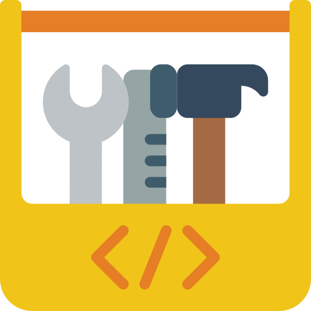

  
  <h1>go-toolbox</h1>
  
A set of utility functions and classes shared between multiple Golang applications and tools

  

   
  
  
  
  
  
  

 

 

<!-- omit in toc -->
## Table of Contents
- [👁️ Overview](#️-overview)
- [✅ Requirements](#-requirements)
- [📃 License](#-license)
- [❓ Questions, Issues and Feature Requests](#-questions-issues-and-feature-requests)

## 👁️ Overview

`go-toolbox` contains common functions and classes that can be used by applications and utilities. This includes everything from advanced error handling to cryptographic functions to an enhanced HTTP client.

Please review the [module documentation](https://pkg.go.dev/go.sophtrust.dev/pkg/toolbox) for details on how to properly the functions and classes contained in this module.

## ✅ Requirements

This module is supported for Go v1.16 and later.

## 📃 License

This module is distributed under the MIT License.

## ❓ Questions, Issues and Feature Requests

If you have questions about this project, find a bug or wish to submit a feature request, please [submit an issue](https://gitlab.com/sophtrust/libraries/go/toolbox/-/issues).
